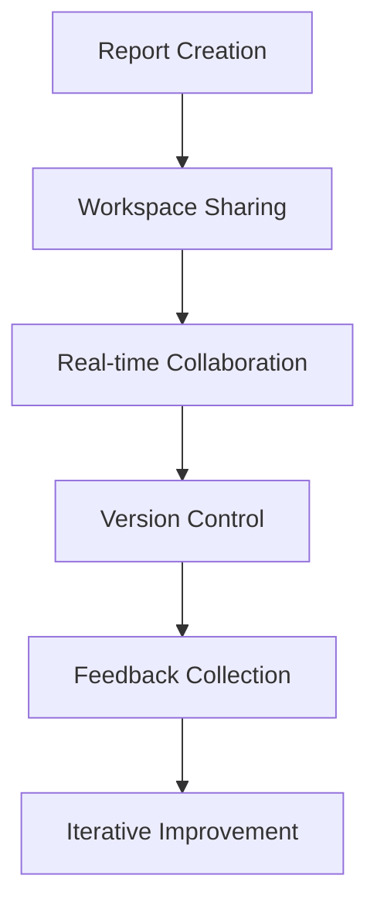

# PowerBI Service & Deployment Guide 🚀

## Introduction

This tutorial covers PowerBI service deployment, workspace management, collaboration features, and best practices for sharing and managing PowerBI solutions in the cloud.

## Table of Contents
1. [PowerBI Service Overview](#powerbi-service-overview)
2. [Workspace Management](#workspace-management)
3. [Publishing Reports](#publishing-reports)
4. [Sharing and Collaboration](#sharing-and-collaboration)
5. [Data Refresh](#data-refresh)
6. [Security and Permissions](#security-and-permissions)
7. [Mobile Access](#mobile-access)
8. [Embedded Analytics](#embedded-analytics)
9. [Administration](#administration)
10. [Best Practices](#best-practices)

## PowerBI Service Overview

### What is PowerBI Service?
PowerBI Service is Microsoft's cloud-based platform for sharing, collaborating, and managing PowerBI reports and dashboards.

### Key Features
- **Cloud hosting** for reports and dashboards
- **Real-time collaboration** and sharing
- **Automatic data refresh**
- **Mobile access** across devices
- **Embedded analytics** for applications
- **Advanced security** and governance

### Service Plans
- **Free**: Basic sharing and collaboration
- **Pro**: Advanced features and larger datasets
- **Premium**: Enterprise features and dedicated capacity
- **Premium Per User (PPU)**: Premium features per user

## Workspace Management

### 1. Creating Workspaces
1. **Access PowerBI Service**
   - Go to app.powerbi.com
   - Sign in with your Microsoft account

2. **Create New Workspace**
   - Click "Workspaces" → "Create workspace"
   - Enter workspace name and description
   - Choose workspace type (Personal, Standard, Premium)

3. **Workspace Settings**
   - Set workspace visibility
   - Configure data source credentials
   - Set up refresh schedules

### 2. Workspace Types

#### Personal Workspace
- Individual workspace for each user
- Cannot be shared with others
- Good for personal projects

#### Standard Workspace
- Shared workspace for teams
- Up to 100 members
- Suitable for most business scenarios

#### Premium Workspace
- Enterprise-grade workspace
- Unlimited members
- Advanced features and larger datasets

### 3. Workspace Administration
```powershell
# PowerShell commands for workspace management
# Connect to PowerBI
Connect-PowerBIServiceAccount

# Get workspaces
Get-PowerBIWorkspace

# Create workspace
New-PowerBIWorkspace -Name "Sales Analytics"

# Add workspace member
Add-PowerBIWorkspaceUser -WorkspaceId "workspace-id" -UserEmail "user@company.com" -AccessRight Member
```

## Publishing Reports

### 1. Publishing from PowerBI Desktop
1. **Prepare Report**
   - Complete report development in PowerBI Desktop
   - Test all visualizations and interactions
   - Verify data sources and refresh settings

2. **Publish Report**
   - Click "Publish" in Home ribbon
   - Select destination workspace
   - Choose publish options
   - Click "Publish"

3. **Post-Publishing Tasks**
   - Set up data refresh schedules
   - Configure sharing permissions
   - Test report access

### 2. Publishing Options
```json
{
  "publishOptions": {
    "overwriteExisting": true,
    "createPackage": false,
    "includeDataSources": true,
    "includeParameters": true
  }
}
```

### 3. Version Control
- **Auto-save**: Automatic version saving
- **Version history**: Track changes over time
- **Rollback**: Restore previous versions
- **Comments**: Add notes to versions

## Sharing and Collaboration

### 1. Sharing Reports
1. **Direct Sharing**
   - Open report in PowerBI Service
   - Click "Share" button
   - Enter email addresses
   - Set permissions (View, Build, Admin)
   - Send invitation

2. **Link Sharing**
   - Generate shareable link
   - Set link permissions
   - Configure expiration settings
   - Share via email or messaging

### 2. Permission Levels
- **Viewer**: Can view reports and dashboards
- **Contributor**: Can edit reports and create new content
- **Member**: Can manage workspace and content
- **Admin**: Full workspace administration

### 3. Collaboration Features


## Data Refresh

### 1. Refresh Types
- **Scheduled Refresh**: Automatic refresh at set intervals
- **Manual Refresh**: On-demand refresh
- **Real-time Refresh**: Live data connections
- **Incremental Refresh**: Partial data updates

### 2. Configuring Refresh
1. **Data Source Settings**
   - Configure connection strings
   - Set authentication methods
   - Test connections

2. **Refresh Schedule**
   - Set refresh frequency (hourly, daily, weekly)
   - Choose refresh time windows
   - Configure time zones

3. **Refresh Monitoring**
   - Monitor refresh status
   - Set up failure notifications
   - Review refresh history

### 3. Refresh Best Practices
```yaml
refresh_configuration:
  frequency: "daily"
  time_window: "02:00-04:00"
  retry_count: 3
  notification_on_failure: true
  incremental_refresh: true
  data_validation: true
```

## Security and Permissions

### 1. Row-Level Security (RLS)
```dax
// RLS filter for sales data
[Region] = USERNAME() || USERNAME() = "admin@company.com"
```

### 2. Object-Level Security
- **Report-level**: Control access to specific reports
- **Dataset-level**: Manage dataset permissions
- **Workspace-level**: Workspace access control

### 3. Data Protection
- **Encryption**: Data encrypted in transit and at rest
- **Audit logs**: Track access and changes
- **Compliance**: Meet regulatory requirements
- **Data residency**: Control data location

### 4. Authentication Methods
- **Azure AD**: Enterprise authentication
- **Microsoft accounts**: Personal accounts
- **Service principals**: Application authentication
- **API keys**: Programmatic access

## Mobile Access

### 1. PowerBI Mobile App
- **iOS**: Available on App Store
- **Android**: Available on Google Play
- **Windows**: Windows Store app

### 2. Mobile Features
- **Offline viewing**: Download reports for offline access
- **Touch interactions**: Optimized for touch devices
- **Push notifications**: Alert for important updates
- **QR code scanning**: Quick report access

### 3. Mobile Configuration
```json
{
  "mobile_settings": {
    "offline_access": true,
    "push_notifications": true,
    "touch_optimized": true,
    "data_usage": "wifi_only"
  }
}
```

## Embedded Analytics

### 1. PowerBI Embedded
- **Embed reports** in custom applications
- **White-label solutions** for customers
- **Scalable pricing** based on usage
- **REST APIs** for programmatic access

### 2. Embedding Options
```html
<!-- Embed report in web page -->
<iframe 
  width="100%" 
  height="600" 
  src="https://app.powerbi.com/reportEmbed?reportId=report-id&groupId=workspace-id">
</iframe>
```

### 3. Embedding APIs
```javascript
// JavaScript embedding
powerbi.embed(embedContainer, {
  type: 'report',
  id: 'report-id',
  embedUrl: 'embed-url',
  accessToken: 'access-token',
  settings: {
    filterPaneEnabled: false,
    navContentPaneEnabled: true
  }
});
```

## Administration

### 1. PowerBI Admin Center
- **User management**: Add/remove users
- **Workspace management**: Create/manage workspaces
- **Usage analytics**: Monitor usage patterns
- **Security settings**: Configure security policies

### 2. Tenant Settings
```yaml
tenant_settings:
  security:
    allow_embedding: true
    allow_external_sharing: false
    allow_guest_access: false
  
  features:
    enable_ai_insights: true
    enable_quick_insights: true
    enable_data_alerts: true
  
  capacity:
    default_workspace_type: "Standard"
    max_workspace_size: "10GB"
```

### 3. Monitoring and Analytics
- **Usage metrics**: Track report usage
- **Performance monitoring**: Monitor report performance
- **Error tracking**: Identify and resolve issues
- **Capacity planning**: Plan for growth

## Best Practices

### 1. Workspace Organization
- **Use consistent naming**: Follow naming conventions
- **Group related content**: Organize by project or department
- **Limit workspace size**: Keep workspaces manageable
- **Document workspace purpose**: Add descriptions

### 2. Security Best Practices
- **Principle of least privilege**: Grant minimum required access
- **Regular access reviews**: Review permissions periodically
- **Use RLS**: Implement row-level security
- **Monitor access**: Track who accesses what

### 3. Performance Optimization
- **Optimize data models**: Use efficient data structures
- **Schedule refreshes wisely**: Avoid peak usage times
- **Use incremental refresh**: For large datasets
- **Monitor performance**: Track report load times

### 4. Collaboration Best Practices
- **Establish workflows**: Define review and approval processes
- **Use comments**: Provide feedback on reports
- **Version control**: Track changes and rollbacks
- **Training**: Educate users on features

## Troubleshooting

### Common Issues

#### 1. Publishing Failures
**Problem**: Reports fail to publish
**Solutions**:
- Check data source connections
- Verify workspace permissions
- Review error messages
- Test with smaller datasets

#### 2. Refresh Failures
**Problem**: Data refresh fails
**Solutions**:
- Verify data source credentials
- Check network connectivity
- Review refresh schedules
- Monitor error logs

#### 3. Access Issues
**Problem**: Users cannot access reports
**Solutions**:
- Check user permissions
- Verify workspace membership
- Review RLS settings
- Test with different accounts

### Debugging Techniques
```powershell
# PowerShell debugging commands
# Check workspace status
Get-PowerBIWorkspace -Scope Organization

# Monitor refresh status
Get-PowerBIDataset -WorkspaceId "workspace-id"

# Check user permissions
Get-PowerBIWorkspaceUser -WorkspaceId "workspace-id"
```

## Real-World Scenarios

### 1. Enterprise Deployment
```yaml
enterprise_setup:
  workspaces:
    - name: "Executive Dashboard"
      type: "Premium"
      members: ["executives@company.com"]
    
    - name: "Sales Analytics"
      type: "Standard"
      members: ["sales-team@company.com"]
    
    - name: "Finance Reports"
      type: "Premium"
      members: ["finance@company.com"]
  
  security:
    rls_enabled: true
    audit_logging: true
    data_encryption: true
  
  refresh_schedule:
    frequency: "daily"
    time_window: "01:00-03:00"
    retry_count: 3
```

### 2. Multi-Tenant Solution
```javascript
// Multi-tenant embedding
function embedReport(tenantId, reportId) {
  const embedConfig = {
    type: 'report',
    id: reportId,
    embedUrl: `https://app.powerbi.com/reportEmbed?reportId=${reportId}`,
    accessToken: generateToken(tenantId),
    settings: {
      filterPaneEnabled: false,
      navContentPaneEnabled: true
    }
  };
  
  powerbi.embed(embedContainer, embedConfig);
}
```

### 3. Mobile-First Strategy
```json
{
  "mobile_strategy": {
    "responsive_design": true,
    "touch_optimized": true,
    "offline_capability": true,
    "push_notifications": true,
    "performance_optimization": true
  }
}
```

## Summary

PowerBI Service deployment enables:
- Cloud-based report hosting
- Real-time collaboration
- Secure data sharing
- Mobile access
- Embedded analytics
- Enterprise governance

## Next Steps
- Set up your first workspace
- Publish a test report
- Configure data refresh
- Implement security policies
- Explore mobile features
- Learn about embedding

---

**Deploy PowerBI solutions with confidence using the cloud platform!** 🚀 